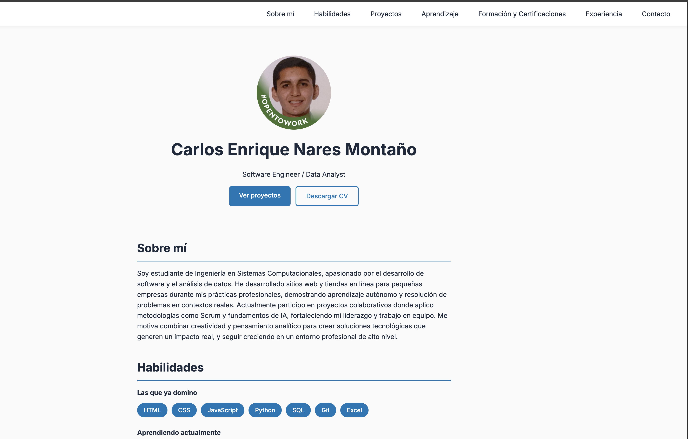

# Portafolio Personal — Carlos Nares

Portafolio personal desarrollado con HTML, CSS y JavaScript vanilla. Diseño responsive con navegación activa mediante scroll.

## 🔗 Demo en vivo

[carlosnm0802.github.io/portafolio-personal](https://carlosnm0802.github.io/portafolio-personal/)

## Stack

- HTML5 semántico
- CSS3 con custom properties
- JavaScript vanilla (sin frameworks)

## Secciones

Sobre mí · Habilidades · Proyectos · Aprendizaje · Formación · Experiencia · Contacto

## Captura de pantalla

